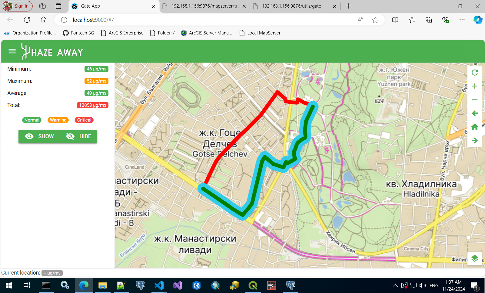

# HazeAway

# Team Y (WHY?)

_Because we care about the air quality!_

1. Мартин Евлогиев - https://www.linkedin.com/in/martin-evlogiev-4a160b84/
2. Bogdan Hristozov - https://www.linkedin.com/in/bogdan-hristozov/
3. Marian Maximov - https://www.linkedin.com/in/marian-maximov-6070662b1/
4. Цветомир Цветков - tsvetomir.tsvetkov93@gmail.com
5. Людмила Бояджиева - https://www.linkedin.com/in/lyudmila-boyadzhieva-65419b86/
6. Adelina Dimova - https://www.linkedin.com/in/adelina-naydenova-8a872840/
7. Chavdar Chenkov - https://www.linkedin.com/in/chenkov/

## What problem do we solve?
Do you know that there are more than **262 million people** with asthma in the world? And this is without even counting other common chronic respiratory diseases (e.g. obstructive pulmonary disease (COPD), occupational lung diseases, and pulmonary hypertension). There are **350,000 people** with asthma only **in Bulgaria**. This means that **1 of every 19 people** have this. So probably you already know someone with this issue, he or she might be your friend, your colleague or as it happens often in Sofia - your kid. And according to the World Health Organization, the biggest risk factors for these diseases are air pollution and dust. Also - fine particles are the main carriers of allergens.

## What do we do? 
We help people with respiratory diseases **navigate through the least contaminated air zones in their everyday life**.

## What data we use?

...

Data from the sensors is interpolated and the resulting raster is loaded into PostgreSQL database. The two possible tracks are loaded into the same database and during the analysis the information from the model is extracted using track coordinates.

## How to use

1. Clone this repo
2. Create a spatial database and import the air pollution model:

```sql
-- create db and load extensions
CREATE EXTENSION postgis;
CREATE EXTENSION postgis_raster;
```
Import the raster to PostgreSQL:
```bash
"C:\Program Files\PostgreSQL\15\bin\raster2pgsql.exe" -C -I -M -F -Y -l 5 -s 4326 -t 25x25 model.tif model > model.sql
```
Create also a table to store user tracks data

```sql
CREATE TABLE IF NOT EXISTS public.tracks
(
    id integer NOT NULL GENERATED ALWAYS AS IDENTITY ( INCREMENT 1 START 1 MINVALUE 1 MAXVALUE 2147483647 CACHE 1 ),
    name text COLLATE pg_catalog."default",
    description text COLLATE pg_catalog."default",
    minimum real,
    maximum real,
    average real,
    total real,
    geometry geometry(LineString,4326),
    created_date timestamp with time zone DEFAULT now(),
    CONSTRAINT comments_pkey PRIMARY KEY (id)
)

TABLESPACE pg_default;

ALTER TABLE IF EXISTS public.tracks
    OWNER to postgres;

CREATE INDEX IF NOT EXISTS tracks_geom_idx
    ON public.tracks USING gist
    (geometry)
    TABLESPACE pg_default;
```

3. Implement a GIS web server.
   The GIS Web server is responsible for serving the tracks data - simple nodejs service can extract the data from the postgresql database and serve it in GeoJSON format.
   
   The GIS server should provide also raster query operation:
   - method `POST`
   - body `{coordinates: [ { latitude: number, longitude: number } ], ... }`
   - response `[ { latitude: number, longitude: number, value: number }, ... ]` (**value is extracted from the raster**)
4. Modify `.src/stores/main-store.js` - set `servicesURL` to point to your GIS server.
5. Run the app:
```
npm install
npm run dev
```



## Track Summary Calculation

For each point of the track, the total amount of pollution (PM10) is extracted from the database and then the following parameters are calculated:

- Maximum Value (µg/m3): `MAX(values)`
- Minimum Value (µg/m3): `MIN(values)`
- Average Value (µg/m3): `SUM(values)/COUNT(values)`
- Total Amount (µg/m3): `SUM(values)`
